# Mappoff Wear

Slimmed down version of [Mappoff](https://github.com/jithware/mappoff) for Wear OS.

## Screenshots

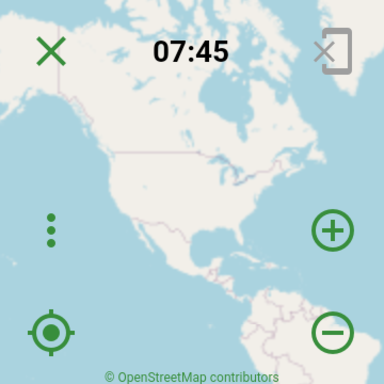
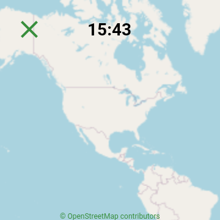
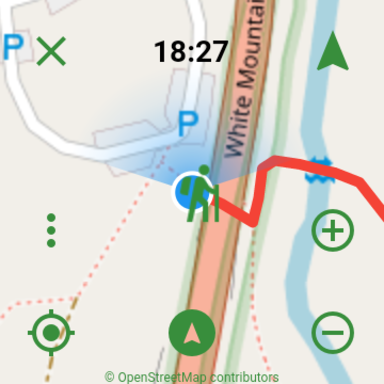
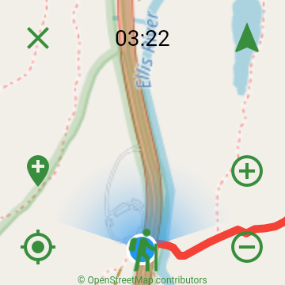
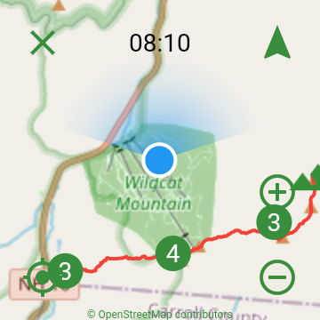
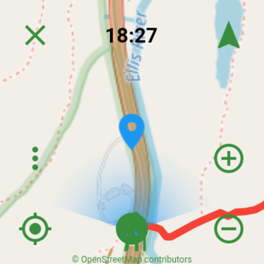
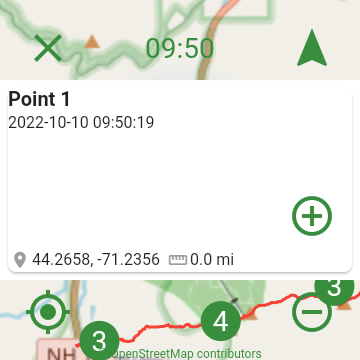
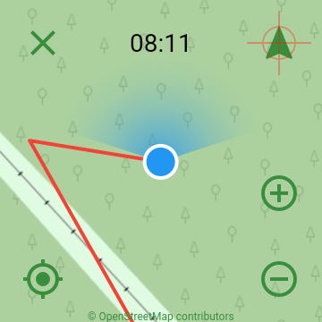

## Usage

### Hide
To hide the buttons, tap the clock. To show the buttons, tap the clock again. 

[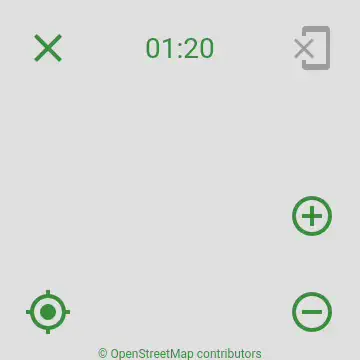](screenshots/android/hide.webp)

### Zoom
To zoom in or out, pinch the screen in or out or press the Zoom In or Zoom Out buttons. 

[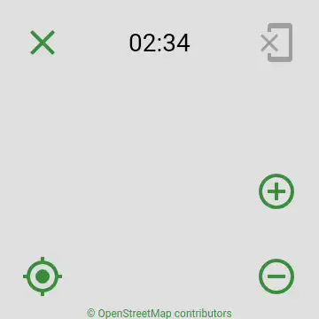](screenshots/android/zoom.webp)

### Move
To move the map, touch anywhere on the map and drag to the location to move to. 

[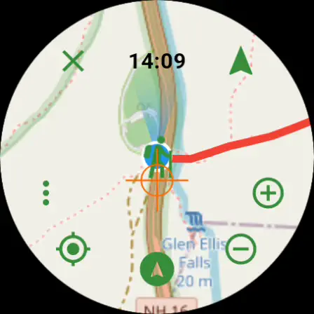](screenshots/android/move.webp)

### Location
To move the map to your current location, press the Location button. 

[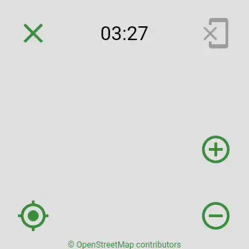](screenshots/android/location.webp)

### Placemark
To add a new placemark, long press a location on the screen. To view the placemark information, tap the placemark. To dismiss the information, tap it again.

[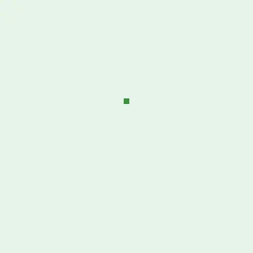](screenshots/android/placemark.webp)

### Tracking
To start tracking, press the Track button. To stop tracking, press the Track button again.

[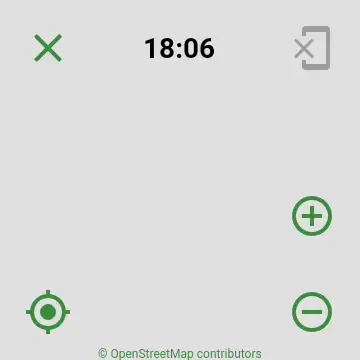](screenshots/android/tracking.webp)

*When adding a placemark or tracking, you must have the [Mappoff](https://play.google.com/store/apps/details?id=com.jithware.mappoff) phone app  running. Additionally, your watch must be setup with the [Wear OS App](https://support.google.com/wearos/answer/6056630) or other similar [watch app](https://play.google.com/store/apps/details?id=com.google.android.apps.wear.companion). You can adjust [placemark](https://github.com/jithware/mappoff#placemark) or [tracking](https://github.com/jithware/mappoff#tracking) settings in the phone app.*

### Preset
To view a preset, connect your watch to your phone and load a [preset](https://github.com/jithware/mappoff#presets) in the phone app. Move or zoom to your preset. Tap a location on the map to load the preset in that location.

## Donate

Donate to the project's maintainer [@jithware](https://github.com/jithware)

 | 
