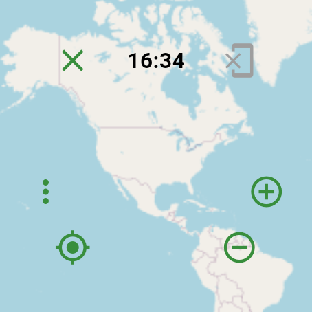
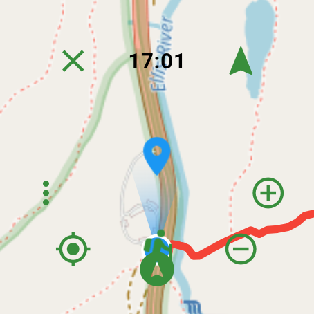
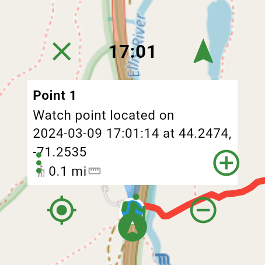
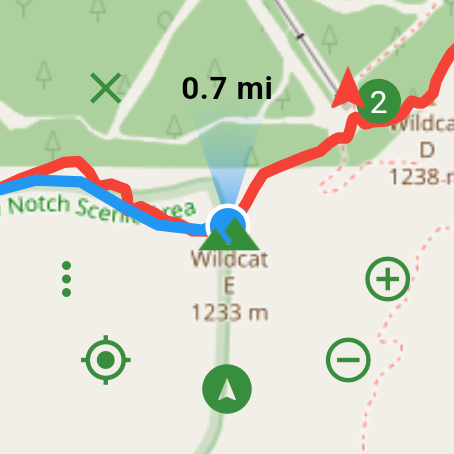
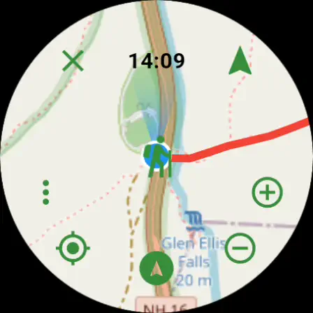
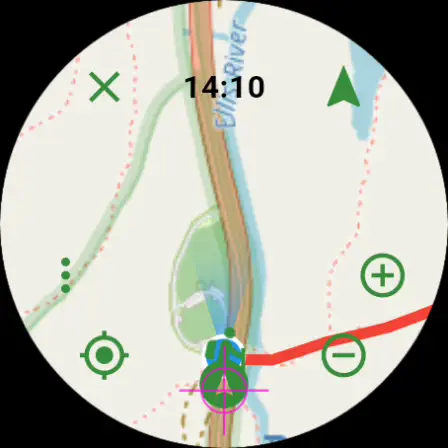
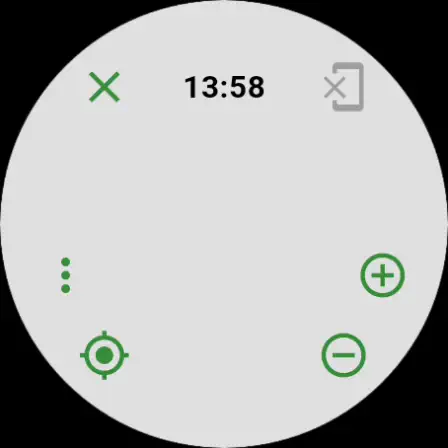

# Mappoff Wear

Slimmed down version of [Mappoff](https://github.com/jithware/mappoff) for Wear OS.

## Screenshots

## Usage

### Hide
To hide the buttons, tap the screen. To show the buttons, tap the screen again 

### Location
To move the map to your current location, press the Location button. 

### Zoom
To zoom in or out, pinch the screen in or out or press the Zoom In or Zoom Out buttons. 

### Move
To move the map, touch anywhere on the map and drag to the location to move to. 

### Placemark
To add a new placemark, long press a location on the screen. To view the placemark information, tap the placemark. To dismiss the information, tap it again.

### Tracking
To start tracking, press the Track button. To stop tracking, press the Track button again.

*When adding a placemark or tracking, you must have the [Mappoff](https://play.google.com/store/apps/details?id=com.jithware.mappoff) phone app installed, configured and running. Additionally, your watch must be setup with the [Wear OS App](https://support.google.com/wearos/answer/6056630). You can adjust [placemark](https://github.com/jithware/mappoff#placemark) or [tracking](https://github.com/jithware/mappoff#tracking) settings in the phone app*

## Donate

Donate to the project's maintainer [@jithware](https://github.com/jithware)

 | 
